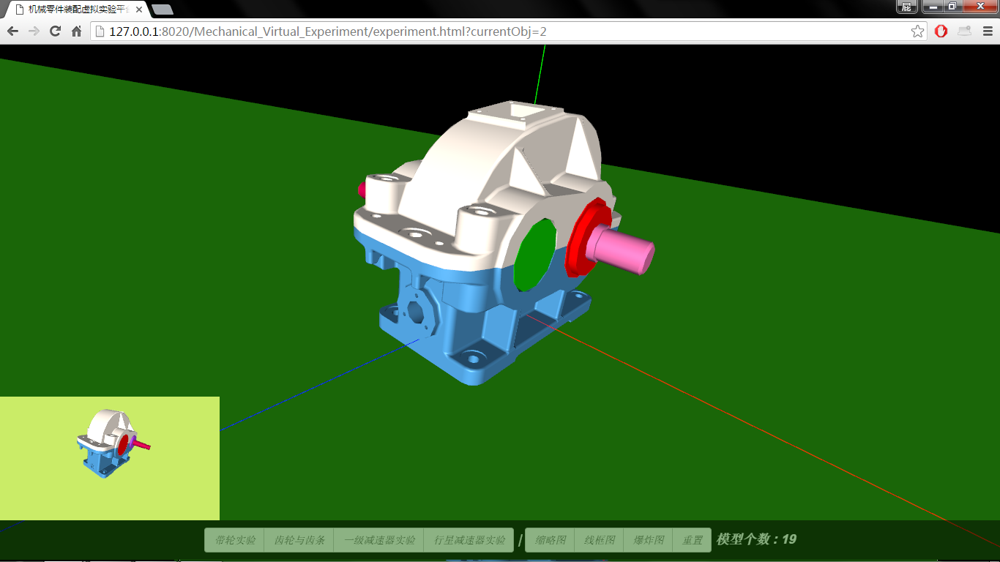
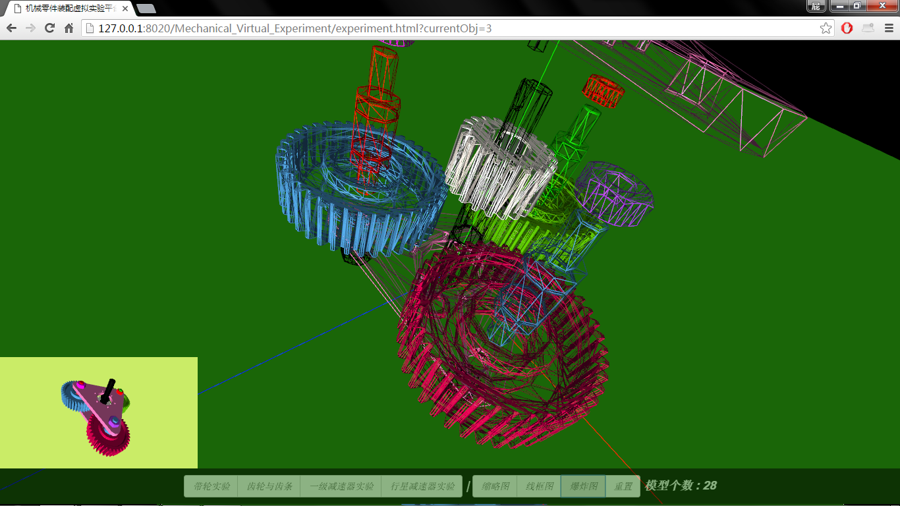
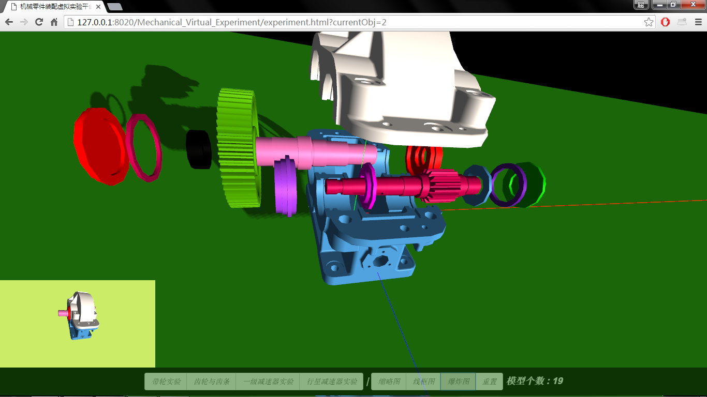

# Mechanical-Part-Assemble-Virtual-experiment-platform

#### 基于 [Three.js](https://github.com/mrdoob/three.js) 的 机械零件装配虚拟实验平台 ...就是简单的展示拼装 3D 零件
#### 下图所有模型为 Pro-e 软件绘制,并导出为 .obj 格式,然后用 Three.js 框架加载展示

初学者作品..代码很烂..为了参加  [中国大学生计算机设计大赛](http://www.jsjds.org) 而制作

预览Gif 正在加载中......

# [在线演示](http://big-pi.github.io/Mechanical-Part-Assemble-Virtual-experiment-platform/)